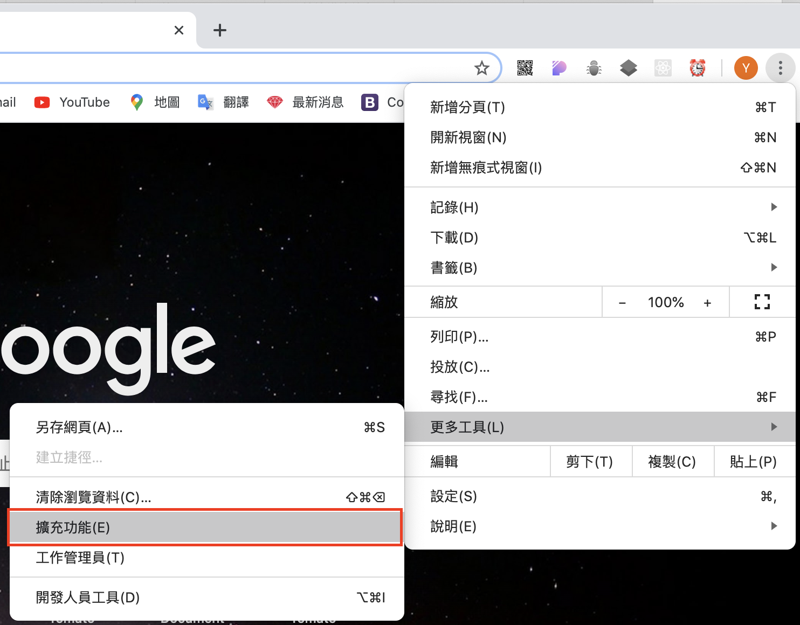
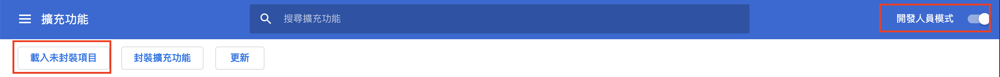

<h1>TomeowTokei</h1>

<h3>目前預設 localhost ，打開專案 localhost 狀態下才能正常使用 chrome extension</h3>

`git clone git@github.com:Tomato-Warrior/TomeowTokei_ext.git` 

打開 chrome 瀏覽器，選擇更多工具，點選擴充功能。

打開“開發人員模式”，”載入未封裝項目“。

選擇方才 clone 的資料夾，此時右上角就會出現方才載入的 extension 。